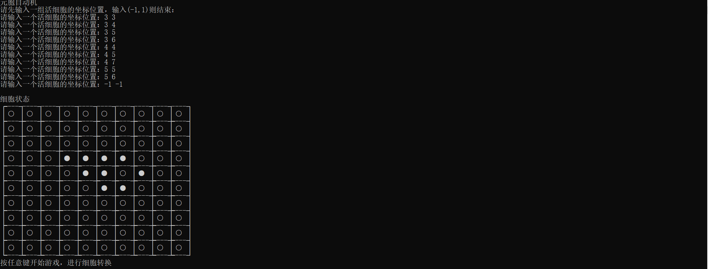
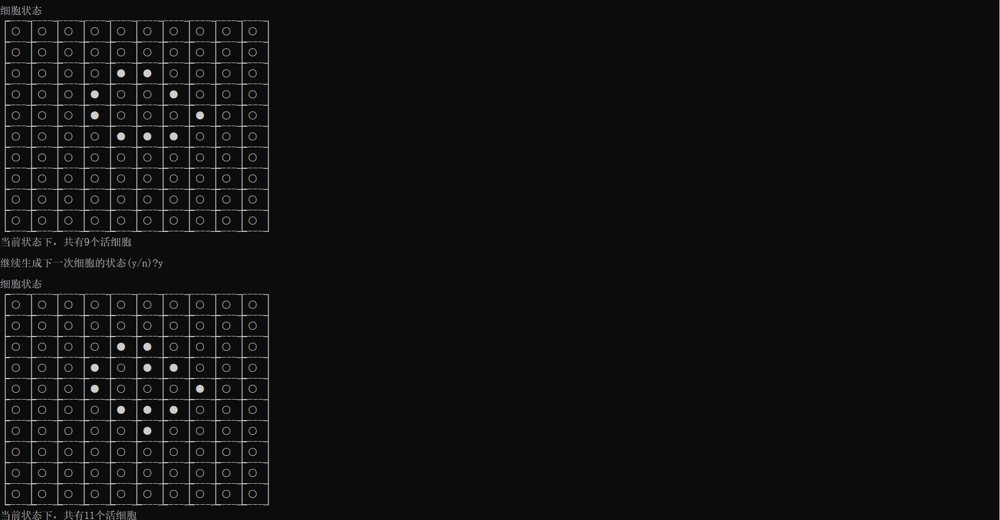
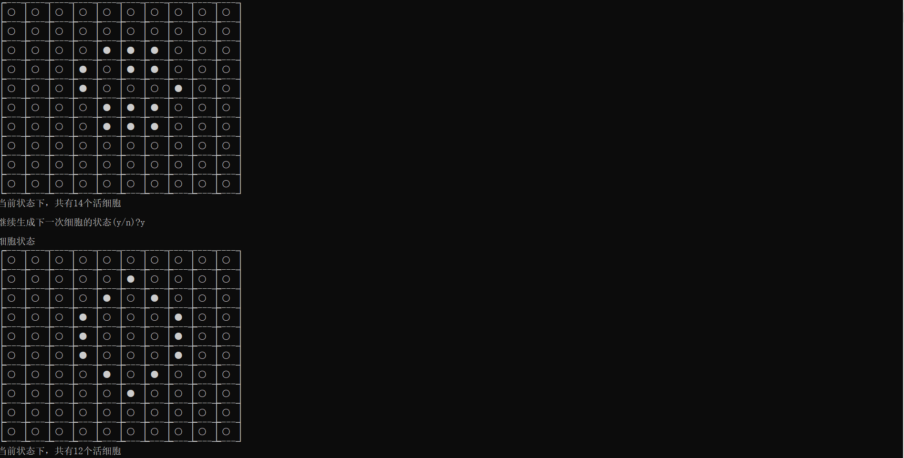
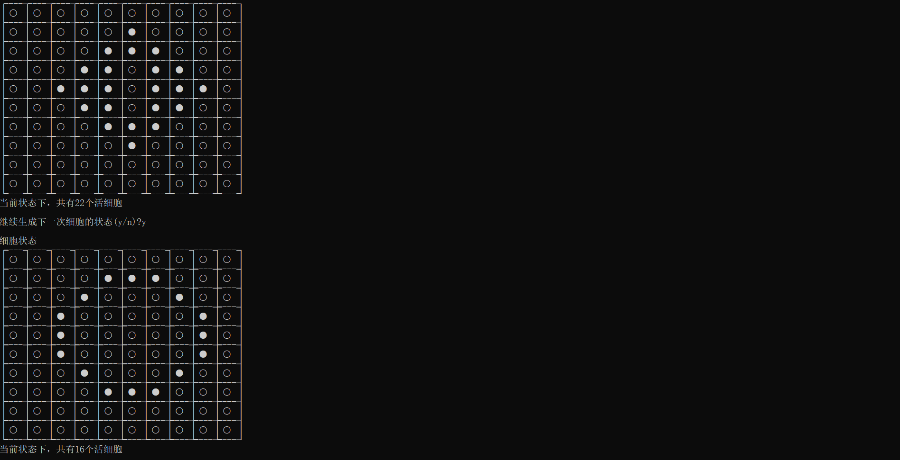

# 元胞自动机(C语言)

规则：
- 死亡：当前细胞是生存状态
    - 孤单死亡：相邻8个网格中没有细胞存在
    - 拥挤死亡：相邻8个网格中细胞数大于或等于4
- 复活：相邻8个网格中恰好有3个细胞且当前细胞是死亡状态
- 状态不变：相邻8个网格中恰好有2个细胞

- [特殊符号1](http://www.fhdq.net/)
- [特殊符号2](http://xh.5156edu.com/page/18466.html)
